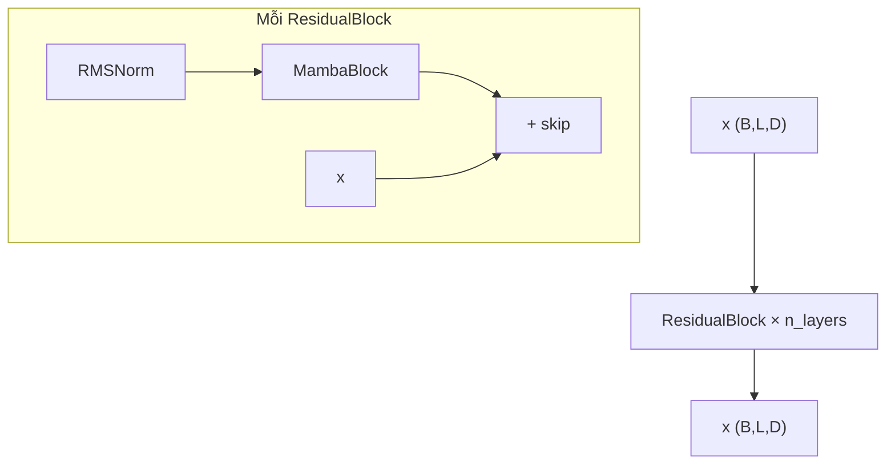

# Chi tiết xử lý: `src/models/backbone.py`

File triển khai **kiến trúc Mamba** dạng module PyTorch: cấu hình `MambaConfig`, xếp chồng **`ResidualBlock`**, bên trong là **`MambaBlock`** (SSM chọn lọc + conv 1D theo thời gian), kèm **`RMSNorm`**. Có API **`forward`** (cả chuỗi) và **`step`** (một bước thời gian, phục vụ suy luận tự hồi quy).

Tham khảo triển khai kiểu mamba-minimal; conv dùng `nn.Conv1d`, scan chọn lọc: **parallel** (`pscan`) hoặc **tuần tự**, hoặc **CUDA** (`mamba_ssm`) nếu bật.

---

## Phần A — `MambaConfig` (dataclass)

### A.1 Các trường chính

| Trường | Ý nghĩa |
|--------|---------|
| `d_model` (D) | Chiều không gian embedding / residual (đầu vào–đầu ra mỗi tầng). |
| `n_layers` | Số `ResidualBlock` xếp chồng. |
| `dt_rank` | Hạng chiếu cho bước Δ (thời gian liên tục rời rạc hóa); mặc định `"auto"`. |
| `d_state` (N) | Kích thước state SSM (paper: state dimension). |
| `expand_factor` (E) | `d_inner = E * d_model` — không gian “rộng” bên trong block. |
| `d_conv` | Kernel conv 1D theo thời gian (depthwise). |
| `dt_min`, `dt_max`, `dt_init`, `dt_scale`, `dt_init_floor` | Khởi tạo và giới hạn cho tham số bước thời gian Δ. |
| `rms_norm_eps`, `base_std` | Ổn định RMSNorm / init (base_std dùng nơi khác nếu mở rộng). |
| `bias`, `conv_bias` | Bias cho `Linear` / `Conv1d`. |
| `inner_layernorms` | Nếu `True`: RMSNorm thêm cho nhánh Δ, B, C bên trong block (kiểu Jamba). |
| `mup`, `mup_base_width` | Hỗ trợ muP (scale width). |
| `pscan` | `True`: selective scan **song song** qua `pscan`; `False`: vòng for tuần tự. |
| `use_cuda` | `True`: gọi `selective_scan_fn` từ `mamba_ssm` (cần cài package; không tương thích (b)float16 theo comment code). |

### A.2 `__post_init__`

1. **`self.d_inner = expand_factor * d_model`** — chiều nội bộ của `in_proj`, conv, SSM.
2. Nếu **`dt_rank == "auto"`**: `dt_rank = ceil(d_model / 16)`.
3. Nếu **`mup`**: `mup_width_mult = d_model / mup_base_width`.

---

## Phần B — `Mamba`

### B.1 Khởi tạo

- `self.layers = ModuleList([ResidualBlock(config) for _ in range(n_layers)])`.

### B.2 `forward(x)`

- **Đầu vào `x`:** `(B, L, D)` embedding chuỗi.
- **Vòng lặp:** mỗi `layer` là một `ResidualBlock`; `x = layer(x)`.
- **Đầu ra:** `(B, L, D)` — cùng shape với đầu vào, sau `n_layers` lần cập nhật có residual.

### B.3 `step(x, caches)` (inference theo token)

- **Đầu vào:** `x` `(B, D)` (một bước embedding); `caches` — list cache, mỗi phần tử cho một `ResidualBlock`.
- **Vòng lặp:** `x, caches[i] = layer.step(x, caches[i])`.
- **Trả về:** `(x, caches)` với `x` `(B, D)`.

---

## Phần C — `ResidualBlock`

### C.1 Cấu trúc

- `self.mixer = MambaBlock(config)`
- `self.norm = RMSNorm(d_model, rms_norm_eps, mup)`

### C.2 `forward(x)` — Pre-Norm residual

Công thức:

```text
output = mixer( RMSNorm(x) ) + x
```

- **Đầu vào / đầu ra:** `(B, L, D)`.
- Giữ **kết nối tắt** (skip) quanh toàn bộ MambaBlock.

### C.3 `step(x, cache)`

- `output, cache = mixer.step(norm(x), cache)`
- `output = output + x`
- Dùng cùng ý tưởng residual nhưng tensor `(B, D)` và cache conv/SSM.

---

## Phần D — `MambaBlock` (chi tiết)

### D.1 Các thành phần học được

1. **`in_proj`:** `Linear(D → 2 * d_inner)` — tách thành hai nhánh `x`, `z` (mỗi nhánh `d_inner`).
2. **`conv1d`:** `Conv1d(d_inner, d_inner, kernel=d_conv, groups=d_inner, padding=d_conv-1)` — **depthwise** trên trục thời gian sau khi transpose `(B,L,ED) → (B,ED,L)`.
3. **`x_proj`:** `Linear(d_inner → dt_rank + 2*d_state)` — sinh raw features cho Δ̃, B, C (input-dependent).
4. **`dt_proj`:** `Linear(dt_rank → d_inner)` — chiếu Δ̃ → không gian `d_inner`; bias khởi tạo đặc biệt liên quan softplus / khoảng `[dt_min, dt_max]`.
5. **`A_log`:** Parameter `(d_inner, d_state)` — lưu `log(|A|)`; trong SSM dùng `A = -exp(A_log)` để ma trận ổn định (hệ dissipative).
6. **`D`:** Parameter `(d_inner,)` — skip tỉ lệ trên nhánh x (D term trong phương trình output).
7. **`out_proj`:** `Linear(d_inner → d_model)`.

**Tùy chọn `inner_layernorms`:** thêm `RMSNorm` cho rank của Δ và cho chiều `d_state` của B, C.

**Tùy chọn `use_cuda`:** import `selective_scan_fn`; nếu lỗi import → tắt CUDA, fallback PyTorch.

### D.2 `forward(x)` — trình tự xử lý (training / full sequence)

Giả sử `x`: `(B, L, D)`.

| Bước | Phép toán | Shape sau bước |
|------|-----------|-----------------|
| 1 | `xz = in_proj(x)` | `(B, L, 2*d_inner)` |
| 2 | `x, z = xz.chunk(2, dim=-1)` | mỗi `(B, L, d_inner)` |
| 3 | `x = x.transpose(1,2)` → `conv1d` → cắt `[:,:,:L]` → `transpose` lại | `(B, L, d_inner)` |
| 4 | `x = silu(x)` | giữ shape |
| 5 | `y = ssm(x, z)` | `(B, L, d_inner)` — luồng SSM (xem Phần E) |

Sau đó **phụ thuộc `use_cuda`:**

- **`use_cuda == True`:** CUDA kernel đã gộp nhiều bước (kể cả nhân với `silu(z)` trong kernel). **`return out_proj(y)`** trực tiếp — **không** nhân `y * z` rồi mới proj trong nhánh Python.
- **`use_cuda == False`:**
  - `z = silu(z)`
  - `output = y * z` (gating theo nhánh z — đúng kiến trúc paper/block thường thấy)
  - `return out_proj(output)`

---

## Phần E — `ssm(x, z)` (State Space với tham số chọn lọc)

### E.1 Chuẩn bị hằng số theo tham số

- `A = -exp(A_log)` → `(d_inner, N)`
- `D = D.float()` (vector độ dài `d_inner`)

### E.2 Sinh Δ, B, C từ `x`

- `deltaBC = x_proj(x)` → `(B, L, dt_rank + 2*N)`
- `split` thành:
  - `delta`: `(B, L, dt_rank)`
  - `B`, `C`: mỗi tensor `(B, L, N)`

### E.3 (Tuỳ chọn) Layernorm nội bộ

- `_apply_layernorms(delta, B, C)` nếu bật `inner_layernorms`.

### E.4 Chiếu Δ lên không gian `d_inner`

- `delta = dt_proj.weight @ delta.transpose(1,2)` → `(B, d_inner, L)` (trong comment: “phần nhân ma trận” của `dt_proj(delta)` trước softplus).

### E.5 Nhánh CUDA

- Transpose `x, B, C, z` sang layout phù hợp kernel.
- Gọi `selective_scan_cuda(..., delta_softplus=True, delta_bias=dt_proj.bias, z=z)`.
- Transpose `y` về `(B, L, d_inner)`.

### E.6 Nhánh PyTorch

- `delta = softplus(delta.transpose(...) + dt_proj.bias)` → `(B, L, d_inner)`.
- Nếu `pscan`: `y = selective_scan(x, delta, A, B, C, D)`.
- Ngược lại: `y = selective_scan_seq(...)` (vòng for theo `t`).

---

## Phần F — `selective_scan` (song song) vs `selective_scan_seq` (tuần tự)

Cả hai cùng ý tưởng **cập nhật state ẩn** theo thời gian rời rạc với hệ số phụ thuộc `delta`, `A`, `B`, `x`, rồi chiếu bằng `C`.

### F.1 Các tensor trung gian (cùng ý nghĩa)

- `deltaA = exp(delta.unsqueeze(-1) * A)` → `(B, L, d_inner, N)`
- `deltaB = delta.unsqueeze(-1) * B.unsqueeze(2)` → `(B, L, d_inner, N)`
- `BX = deltaB * x.unsqueeze(-1)` → `(B, L, d_inner, N)`

### F.2 Song song (`selective_scan`)

- `hs = pscan(deltaA, BX)` — **parallel scan** trên chiều thời gian (triển khai trong `src.utils.pscan`).
- `y = (hs @ C.unsqueeze(-1)).squeeze(3)` — mỗi bước lấy “quan sát” từ state qua `C`.
- `y = y + D * x` — cộng skip tỷ lệ D theo đầu vào.

### F.3 Tuần tự (`selective_scan_seq`)

- Khởi tạo `h = 0` kích thước `(B, d_inner, N)`.
- Với `t = 0 … L-1`: `h = deltaA[:,t] * h + BX[:,t]`, lưu `h` vào list.
- `stack` → `hs` `(B, L, d_inner, N)`, rồi giống bước nhân `C` và `+ D*x`.

---

## Phần G — Inference: `step` và `ssm_step`

### G.1 Cache mỗi tầng (`MambaBlock.step`)

Docstring trong file giải thích:

- **`h`:** state SSM `(B, d_inner, N)`.
- **`inputs`:** `(B, d_inner, d_conv-1)` — lưu `d_conv-1` bước conv gần nhất để conv1d causal đúng mà không cần lưu cả chuỗi.

**Trình tự (tóm tắt):**

1. `xz = in_proj(x)`, tách `x`, `z`.
2. Ghép `inputs` với `x` hiện tại, chạy conv1d, lấy output đúng vị trí causal.
3. `silu(x)`, `y, h = ssm_step(x, h)`.
4. `silu(z)`, `output = y * z`, `output = out_proj(output)`.
5. Cập nhật `inputs` (shift + append bước mới).

### G.2 `ssm_step`

- Giống logic SSM nhưng **một timestep**, cập nhật `h` rõ ràng: `h = deltaA * h + BX`, v.v.
- Phù hợp sinh văn bản hoặc stream có độ phức tạp bộ nhớ **O(1)** theo độ dài chuỗi đã đọc (thay vì materialize toàn bộ L).

---

## Phần H — `RMSNorm`

### H.1 Khởi tạo

- `eps` tránh chia cho 0 khi RMS ≈ 0.
- Nếu **`use_mup=False`**: có `weight` nhân theo chiều feature (chuẩn RMSNorm có scale).
- Nếu **`use_mup=True`**: **không** tạo `weight` (theo gợi ý paper muP — tránh “gains” cản muTransfer).

### H.2 `forward(x)`

- `output = x * rsqrt(mean(x², dim=-1, keepdim=True) + eps)`
- Nếu không muP: `return output * weight`; ngược lại chỉ `output`.

---

## Phần I — Sơ đồ luồng tổng quát (full sequence)



Trong `MambaBlock`: **in_proj → split x,z → conv1d+SiLU trên x → SSM → (z gate) → out_proj**.

---

## Phần J — File phụ thuộc

- **`src.utils.pscan`:** `pscan` cho selective scan song song (nhánh `pscan=True`, `use_cuda=False`).

Khi đọc code, luôn phân biệt **ba nhánh thực thi SSM:** PyTorch+pscan, PyTorch+tuần tự, và CUDA `mamba_ssm`, vì đường `forward` sau SSM **khác nhau** giữa CUDA và PyTorch (nhánh z / `out_proj`).
