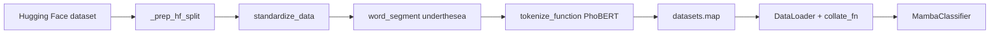

# Luồng xử lý token từ dataset trong project

Tài liệu mô tả **từng bước** biến văn bản thô trong dataset Hugging Face thành tensor đưa vào `MambaClassifier`, căn cứ trên `train.py` (luồng huấn luyện chính) và script minh họa `mambatokenize.py`.

---

## 1. Nguồn dữ liệu và schema

- **Dataset mặc định:** `uitnlp/vietnamese_students_feedback` (cấu hình trong `get_default_config()` → khóa `dataset_name`).
- **Tải dữ liệu:** `datasets.load_dataset(config["dataset_name"])`, dùng các split `train` và `test`.
- **Cột gốc trên Hugging Face:** thường gồm `sentence`, `sentiment`, `topic`, v.v.

Hàm `_prep_hf_split()` chuẩn hóa schema cho code huấn luyện:

| Trước (HF)   | Sau (trong code) |
|-------------|------------------|
| `sentence`  | `text`           |
| `sentiment` | `label`          |

Mọi cột khác (`topic`, …) bị **loại bỏ** để dataset chỉ còn `text` và `label`. Nhãn `label` là số nguyên lớp cảm xúc (0, 1, 2 — `num_classes: 3`).

---

## 2. Chuẩn hóa văn bản (`standardize_data` / `_standardize_one`)

Mục tiêu: giảm nhiễu ký tự, thống nhất chữ thường và khoảng trắng trước khi tách từ và gọi tokenizer.

**Thứ tự xử lý (một chuỗi):**

1. **Bỏ dấu câu cuối câu** bằng biểu thức chính quy: `.,?` ở **cuối** chuỗi (`re.sub(r"[\.,\?]+$", "", text)`).
2. **Thay các dấu câu / ký tự** bằng khoảng trắng: `, . ; “ : ” " ' ! ? -` (và các biến thể tương tự trong `replace(...)`).
3. **Gộp khoảng trắng:** `re.sub(r"\s+", " ", text)` — tab, nhiều space, xuống dòng → một space.
4. **Cắt hai đầu và chữ thường:** `strip().lower()`.

**Chế độ batch:** khi `datasets.map(..., batched=True)` truyền vào list chuỗi, `standardize_data` áp dụng `_standardize_one` **cho từng phần tử** của `examples["text"]`.

---

## 3. Tách từ tiếng Việt (`word_segment`)

- Gọi **`underthesea.word_tokenize(text, format="text")`**.
- Kết quả là chuỗi các từ được phân tách bằng **khoảng trắng** (định dạng “text”), phù hợp để PhoBERT token hóa theo từ đã bước đầu phân đoạn.
- Với batch, hàm lặp trên từng chuỗi đã chuẩn hóa.

**Thứ tự pipeline trên mỗi mẫu (trong `prepare_data`):**  
`standardize_data` → **sau đó** → `word_segment`.

---

## 4. Token hóa PhoBERT (`tokenize_function`)

- **Tokenizer:** `AutoTokenizer.from_pretrained(config["tokenizer_name"])` — mặc định **`vinai/phobert-base`**.
- **Đầu vào:** trường `text` (đã chuẩn hóa + tách từ), và `label` giữ nguyên làm nhãn huấn luyện.

**Tham số gọi `tokenizer(...)`:**
- `padding="max_length"` — mọi câu được pad đến đúng `max_length`.
- `truncation=True` — câu dài hơn bị cắt.
- `max_length` — mặc định **512** (`config["max_length"]`).

**Tensor vs list (quan trọng khi map batch):**

- **Một câu:** `return_tensors="pt"` → `input_ids` / `attention_mask` dạng tensor PyTorch.
- **Nhiều câu (batched map):** `return_tensors=None` → các trường tokenizer là **list** số nguyên (phù hợp lưu trong Arrow / Hugging Face `datasets`).

**Đầu ra của `tokenize_function`:** toàn bộ dict tokenizer (`input_ids`, `attention_mask`, …) **gộp thêm** khóa `labels` lấy từ `examples["label"]`.

---

## 5. Ánh xạ lên toàn bộ split (`datasets.map`)

Trong `prepare_data`:

1. `train_src` / `test_src` đã qua `_prep_hf_split`.
2. `tokenized_train` / `tokenized_test` được tạo bằng:
   - `map(lambda x: tokenize_function(word_segment(standardize_data(x)), tokenizer, max_length), batched=True, remove_columns=...)`
3. **`remove_columns`:** xóa hết cột gốc (`text`, `label`), chỉ giữ các cột sau token hóa (ví dụ `input_ids`, `attention_mask`, `labels`).

Như vậy **một lần qua map** thực hiện đủ: chuẩn hóa → tách từ → PhoBERT tokenize.

---

## 6. DataLoader và `collate_fn` (từ batch HF → tensor huấn luyện)

`DataLoader` đọc từng **batch** các dict đã token hóa. Hàm `collate_fn`:

1. **`input_ids`:** mỗi phần tử trong batch là list (hoặc tương đương) → `torch.tensor` từng dòng.
2. **`pad_sequence(..., batch_first=True)`:** nếu trong cùng batch có độ dài khác nhau, pad thêm **0** ở cuối cho bằng sequence dài nhất trong batch.
   - *Lưu ý:* sau bước map, về lý thuyết mọi câu đã `max_length` cố định; `pad_sequence` vẫn đảm bảo an toàn khi có chiều dài lệch.
3. **`unsqueeze(-1)`:** tensor kết quả có dạng **`(batch, seq_len, 1)`** — đúng với `MambaClassifier.forward` (embedding nhận token id, `squeeze(-1)` trước `nn.Embedding`).
4. **`labels`:** `torch.tensor([...])` dạng vector `(batch,)`.

---

## 7. Trong mô hình (`MambaClassifier`)

- `input_ids` kiểu float trên device được đổi sang long: `x.long().squeeze(-1)`.
- **`nn.Embedding(vocab_size, d_model)`** — `vocab_size` lấy từ `tokenizer.vocab_size`.
- Chuỗi embedding đi qua backbone Mamba rồi `ClassifierHead` → `logits` và `CrossEntropyLoss` với `labels`.

Toàn bộ “ý nghĩa token” ở đây là **ID trong bảng từ vựng PhoBERT**, không dùng vector BERTContext từ `AutoModel` — chỉ dùng **tokenizer** để sinh ID.

---

## 8. So sánh nhanh với `mambatokenize.py`

File `mambatokenize.py` minh họa **cùng ý tưởng** (chuẩn hóa → `underthesea` → tokenizer) trên dữ liệu mẫu cứng (`data` list), với khác biệt nhỏ:

- Ví dụ dùng khóa **`sentiment`** (chuỗi như `"positive"`) thay vì `label` số.
- `tokenize_function` trong file đó trả về `labels: examples["sentiment"]` và với một câu có thể dùng `return_tensors="pt"`.

Luồng **huấn luyện thực tế** luôn lấy từ **`train.prepare_data`** + **`tokenize_function`** như mục 4–7.

---

## 9. Tóm tắt pipeline (sơ đồ logic)

---

## 10. Cấu hình liên quan (tham khảo)

| Khóa / thành phần      | Giá trị / vai trò mặc định   |
|------------------------|------------------------------|
| `dataset_name`         | `uitnlp/vietnamese_students_feedback` |
| `tokenizer_name`       | `vinai/phobert-base`         |
| `max_length`           | 512                          |
| `batch_size`           | 32                           |
| `num_classes`          | 3                            |

Chỉnh các giá trị này trong `get_default_config()` (hoặc truyền `config` tương đương nếu bạn refactor) sẽ thay đổi trực tiếp cách tải dữ liệu, độ dài chuỗi token và kích thước batch sau mọi bước trên.
